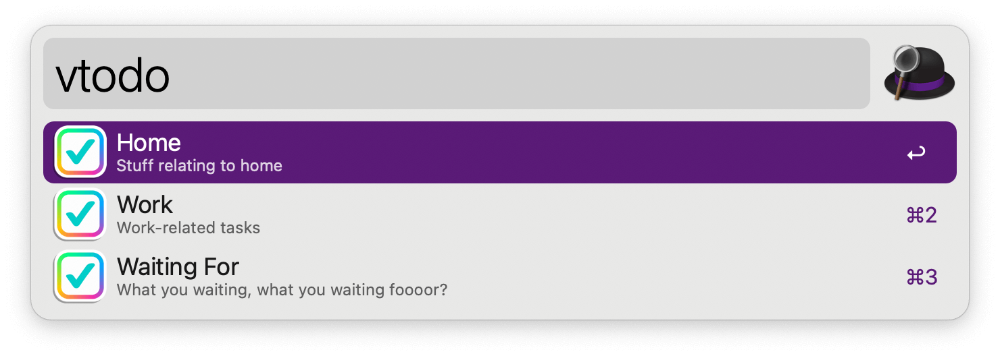

#  Simple To-Do List Alfred Workflow

Add tasks to to-do lists and view them

<a href='https://alfred.app/workflows/alfredapp/simple-to-do-list'>⤓ Install From the Alfred Gallery</a>

## Usage

Append to-do items to a text file via the `todo` keyword. Type your task, press <kbd>⏎</kbd>, and choose the list to add to.

View your lists with the `vtodo` keyword. Press <kbd>⏎</kbd> to open the corresponding text file.

